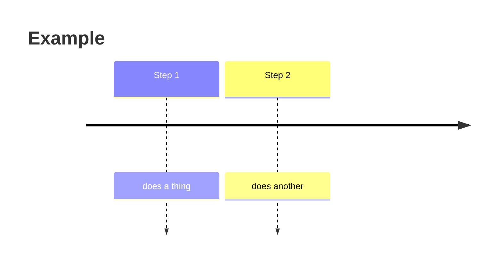

# giulio-quaglia.com — Site Repository

Personal portfolio and blog. Vanilla HTML/CSS/JS, no build step, hosted on Netlify
with automatic deploys from this repository.

The homepage (`index.html`) and blog index (`blog.html`) render through a tiny
self-contained runtime (`support.js`) that loads React from **jsDelivr** at page
load — no bundler, no `npm install`, nothing to compile. jsDelivr is already
allowed by the Content-Security-Policy in `netlify.toml`, so deploys keep working
as-is. The post reader (`post.html`) is plain JavaScript.

---

## Folder structure

```
/
├── index.html            # Portfolio homepage (shows the latest 3 posts)
├── blog.html             # Blog index (featured + grid + category filters)
├── post.html             # Post reader — renders any posts/<slug>.md
├── blog-posts.js         # Blog data source: loads posts/*.md, feeds index + blog
├── support.js            # Runtime for index.html / blog.html (loads React)
├── favicon.svg
├── netlify.toml          # Security headers / CSP
├── CV_Giulio_Quaglia_DataEng.pdf   # linked from the contact section
├── assets/               # Homepage hero image
├── uploads/              # Section background images (experience / skills / contact)
├── netlify/functions/
│   └── send-cv.js        # Emails the CV PDF (contact form backend)
└── posts/
    ├── images/           # Post images, GIFs, SVGs, video files
    └── *.md              # One Markdown file per post
```

---

## How the blog is wired

`blog-posts.js` is the single source of truth. On load it fetches every post listed
in its `POST_FILES` array, reads the frontmatter, and publishes the list to **both**
the homepage and the blog page (sorted newest first). Clicking a post opens
`post.html?p=<slug>`, which fetches and renders that `.md`. The blog's category
filter chips are generated automatically from the posts' `category` values — no
hard-coded filter list to maintain.

---

## How to write a new post

### Step 1 — Create the Markdown file

Create `posts/<slug>.md`. The filename (without `.md`) is the URL slug — use
lowercase words separated by hyphens. Every file starts with a frontmatter block
between two `---` lines:

```
---
title: Your Post Title Here
date: 2025-07-20
category: data eng
excerpt: One sentence shown as the card preview on the homepage and blog.
---

Your post content starts here...
```

**Valid categories** (drive the card label and the filter chip):

| frontmatter value      | shown as      |
|------------------------|---------------|
| data eng               | data eng      |
| machine learning eng   | ml eng        |
| software eng           | software eng  |
| biomed eng             | biomed eng    |
| finance                | finance       |
| cryptography           | crypto        |
| health                 | health        |
| sport                  | sport         |

To add a brand-new category, add one line to the `CAT_LABELS` map in `blog-posts.js`.

### Step 2 — Register the post in `blog-posts.js`

Add the slug to the `POST_FILES` array near the top of `blog-posts.js`:

```js
var POST_FILES = [
  'my-post-about-python',            // <- add here
  '2024-02-03-crash-biomechanics',
  '2024-01-27-hip-biomechanics',
  // ...
];
```

Order doesn't matter — posts are sorted by date automatically. The homepage,
the blog list, and the filter chips all update from this one change.

### Step 3 — Push

```bash
git add .
git commit -m "post: my post about python"
git push
```

Netlify detects the push and redeploys in ~30 seconds.

---

## Markdown reference

### Text formatting

```markdown
**bold text**
*italic text*
***bold and italic***
`inline code`
[link text](https://example.com)
```

### Headings, lists, quotes

```markdown
## Section heading
### Subsection heading

- unordered item
1. ordered item

> Highlighted quote block.

---   (horizontal rule)
```

### Code snippets

Triple backticks with a language name get syntax highlighting (Prism).
Supported: `python`, `sql`, `bash`, `javascript`, `java`, `r`, `yaml`.

````markdown
```python
df = spark.read.parquet("s3://bucket/data")
df.groupBy("category").agg(count("*")).show()
```
````

### Diagrams (Mermaid)

Fenced `mermaid` blocks render as diagrams (timeline, xychart, flowchart, …):

````markdown

````

---

## Images and media

Put the file in `posts/images/`, then reference it **with the `posts/` prefix**
(paths are resolved relative to the site root, where `post.html` lives):

```markdown


@[video](posts/images/demo.mp4)
@[youtube](VIDEO_ID)
@[vimeo](VIDEO_ID)
```

Images are lazy-loaded. Use `.svg`, `.png`, `.jpg`, `.jpeg`, `.gif`, `.webp`.
Embeds are responsive 16:9.

---

## Updating the CV

Replace `CV_Giulio_Quaglia_DataEng.pdf` in the root, keeping the same filename —
the contact form (which emails the PDF via `netlify/functions/send-cv.js`) and the
download button pick it up automatically. To use a different filename, update the
reference in `index.html` and in `netlify/functions/send-cv.js`.

---

## Local development

No build tools. The pages use `fetch()` (posts, Markdown), which browsers block on
`file://`, so run a local server:

```bash
python3 -m http.server 8000      # then open http://localhost:8000
# or: npx serve .
```

Note: `index.html` and `blog.html` pull React from jsDelivr on first load, so the
first local run needs an internet connection (it's then cached by the browser).

---

## Netlify: keep "Pretty URLs" off

Netlify's HTML post-processing (**Pretty URLs**) rewrites every `<a>` whose `href`
ends in `.html` — and when it does, it drops the inline `style` / `style-hover`
attributes on that link. On the live site that left the nav's `05 blog` item and the
homepage **ALL POSTS** button completely unstyled, while identical links with a query
string (`post.html?p=…`) or a plain hash (`#about`) rendered fine.

`netlify.toml` now disables it (`[build.processing.html] pretty_urls = false`) and
adds `301` redirects so `/blog` and `/post` keep working. If it ever gets re-enabled
in the Netlify UI (Site configuration → Build & deploy → Post processing), the same
links break again.

Second line of defence: every link that can be stripped this way also has a plain CSS
rule in the page's `<style>` block (`#navLinks a`, `#blogCta a`, `#bNavLinks a`,
`#blogSite header a`, `#blogSite footer a`, …). **When you add a new styled link that
points at a `.html` page, add a matching CSS rule** — target it through its parent
(e.g. `#blogCta a`), never through an attribute on the link itself, since those are
what get stripped.

---

## Domain setup (Wix DNS → Netlify)

1. Deploy this repo on [Netlify](https://app.netlify.com) and link it to this repository.
2. Netlify → **Site settings → Domain management → Add custom domain**.
3. Copy the `A` record and `CNAME` values Netlify shows.
4. In Wix → **Domains → Manage → DNS Records** → replace the A record and add the CNAME.
5. Wait for propagation (usually < 30 min). Netlify provisions SSL automatically.
