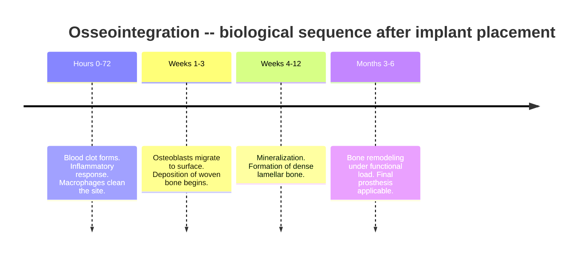

In 1952, a Swedish surgeon named Per-Ingvar Branemark was studying blood flow in rabbit bone marrow. He had inserted a small titanium optical chamber into a rabbit's tibia. When the time came to remove it, he couldn't. Bone had grown around the metal so densely and intimately that there was no plane of separation.

Branemark called this **osseointegration**. It took another 20 years before anyone believed in the discovery enough to apply it to human dental implants.

## Why titanium and not other metals

Not all metals osseointegrate. Titanium's distinction is its **surface chemistry**: when exposed to oxygen (even just room air), it instantly forms an ultrathin layer of **titanium dioxide (TiO2)**, typically 3-7 nanometres thick.

This oxide layer is:
- **Stable**: it doesn't dissolve in biological fluids
- **Inert**: it doesn't release toxic ions
- **Hydrophilic**: it attracts water molecules and plasma proteins

It's this oxidized surface that makes first biological contact with surrounding tissue. Not pure titanium. The TiO2 is what bone sees.

 between the titanium bulk and the biological environment. Plasma proteins adsorb first; osteoblasts follow.")

When an implant is placed, the blood clot that forms around it triggers a cascade: **plasma proteins** adsorb onto the surface, platelets and immune cells follow, then **osteoblasts** (the cells that build bone). Within weeks, osteoblasts deposit new bone directly onto the titanium surface.

## Surface matters more than shape

One of the most important discoveries in implant research: **surface microtopography influences the biological response more than macroscopic shape**.

A polished implant (Ra < 0.5 um) and a rough one (Ra = 1-2 um) look identical to the naked eye but behave very differently biologically. Rough surfaces offer:
- Greater real contact area
- Mechanical anchoring for initially adsorbed proteins
- Topographic cues that guide osteoblast behavior (a phenomenon called **contact guidance**)

The most widely used surface treatment for modern dental implants is **SLA** (Sandblasted, Large grit, Acid-etched): the surface is sandblasted with coarse alumina particles, then etched with hydrochloric and sulfuric acid. The result is a surface with micro-roughness at two length scales that maximizes osseointegration.

Some manufacturers add a final treatment to make the surface **superhydrophilic** (contact angle with water < 5 degrees). Clinical studies show faster early osseointegration, with some protocols achieving loading as early as 21 days.

## The healing timeline

This is why implantologists traditionally wait 3-6 months before loading the implant with the final crown.

Implant stability is measured via **resonance frequency analysis** using the **ISQ** (Implant Stability Quotient): 0-100, with values > 65-70 considered sufficient for early loading. Some advanced surfaces allow the prosthesis within 48 hours of placement, but require adequate primary stability at the time of surgery.

## The difference from a real tooth

A natural tooth is not anchored directly to bone. It's suspended in the socket by a system of collagen fibers called the **periodontal ligament** (PDL), roughly 0.25 mm thick.

This ligament acts as a biological shock absorber. It distributes masticatory forces across the alveolar bone in a controlled way, and contains **mechanoreceptors** that give the tooth fine tactile sensitivity. You can feel a grain of sand between your teeth because the PDL signals it through specialized nerve fibers.

An osseointegrated implant has none of this. It's rigidly anchored to bone. Masticatory force transmits directly without cushioning, and load perception is reduced. Not worse, not better. Different. It's one of the open engineering problems for the next generation of implants.

. Right: titanium implant in direct contact with cortical bone -- no ligament, no shock absorption.")

## Success rates and the unsolved problem

> The 10-year survival rate for dental implants exceeds **95%** in non-smokers without systemic pathologies -- one of the most robust numbers in oral surgery.

The primary cause of late failure is **peri-implantitis**: bacterial infection affecting soft tissue and bone around the implant. Analogous to periodontitis but harder to treat, because the implant lacks the biological defenses of a natural tooth.

Smokers have approximately twice the implant failure rate of non-smokers, with systematic reviews reporting 100-160% higher odds of failure. Nicotine causes peripheral vasoconstriction that impairs vascularization needed for osseointegration. One of the few cases in medicine where epidemiological data and biological mechanisms align perfectly.

Branemark hadn't solved everything. But he understood that biology can collaborate with engineering, if you speak the language bone understands: the language of surface.

## References

- Branemark PI et al. (1977). Osseointegrated implants in the treatment of the edentulous jaw. *Scandinavian Journal of Plastic and Reconstructive Surgery*, 11(Suppl 16), 1-132.
- Albrektsson T, Branemark PI, Hansson HA & Lindstrom J (1981). Osseointegrated titanium implants. *Acta Orthopaedica Scandinavica*, 52(2), 155-170.
- Buser D, Schenk RK, Steinemann S, Fiorellini JP, Fox CH & Stich H (1991). Influence of surface characteristics on bone integration of titanium implants. *Journal of Biomedical Materials Research*, 25(7), 889-902.
- Pjetursson BE, Heimisdottir K & Karoussis I (2019). Long-term (10-year) dental implant survival: A systematic review and sensitivity meta-analysis. *Clinical Oral Implants Research*, 30(Suppl 19), 1-5. (PMID: 30904559)
- Chrcanovic BR, Albrektsson T & Wennerberg A (2015). Smoking and dental implants: A systematic review and meta-analysis. *Journal of Dentistry*, 43(5), 487-498. (PMID: 25778741)
