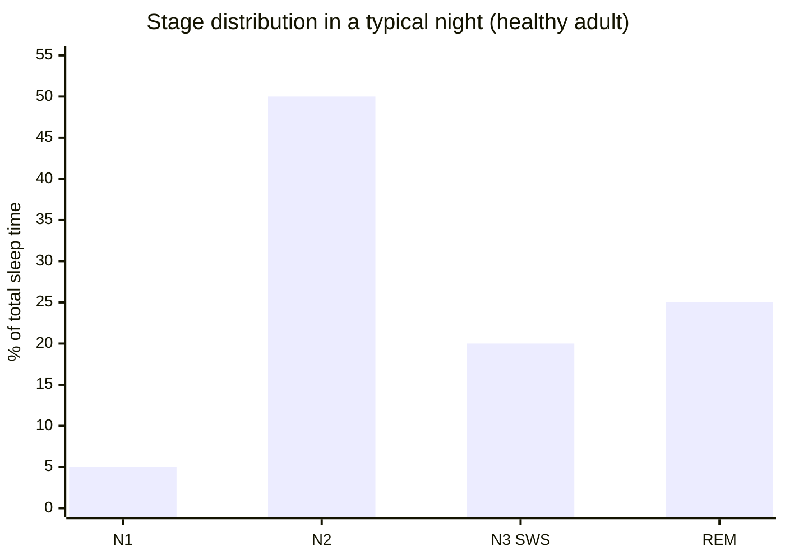
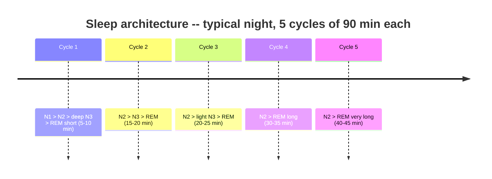

We spend roughly a third of our lives asleep. Almost everyone agrees it's necessary. Most people have a vague idea of what's actually happening. "The body rests" is about as informative as "the computer does a backup."

During my thesis on automated sleep staging, I spent a lot of time looking at polysomnography recordings: the actual signals from sleeping brains. What you see is not a quiet system. It's a structured sequence of states, each with its own EEG signature and its own biological function.

## The tool: polysomnography

The standard for studying sleep is **polysomnography (PSG)**: simultaneous recording of brain electrical activity (EEG), eye movements (EOG), chin muscle tone (EMG), heart rate (ECG), respiration, and oxygen saturation.

From these signals, trained technicians (and increasingly, machine learning algorithms) assign each 30-second window one of five stages: **N1, N2, N3, REM**, or **Wake**.

The result is visualized as a **hypnogram**: a time-series plot of stage transitions through the night. It's the biomedical signature of a night's sleep.

 concentrates in the first two cycles. REM periods (purple) grow progressively longer toward morning. Data pattern from Dijk & Czeisler (1995).")

## N1: the threshold

N1 is the transition from wake to sleep. It lasts a few minutes and accounts for roughly **5% of total sleep time**.

The EEG shows disappearance of alpha waves (8-12 Hz, characteristic of relaxed wakefulness) and emergence of theta waves (4-7 Hz). Consciousness isn't fully suspended yet. If you wake someone from N1, they often won't believe they were asleep.

N1 is also where **hypnic jerks** happen: that sudden falling sensation that jolts you awake. The most accepted explanation is a reflex response to rapid muscle relaxation, misinterpreted by the brain as a loss of balance.

## N2: the memory machine

N2 accounts for roughly **50% of the night**. It's the most abundant stage, and probably the most underrated.

Two specific EEG features define N2:

**Sleep spindles**: brief bursts of 12-14 Hz oscillations, 0.5-2 seconds long, generated by the thalamus. They appear to correlate with **procedural memory consolidation**. After a motor learning session, spindle density in subsequent sleep increases measurably.

**K-complexes**: sharp high-amplitude waves (a negative peak followed by a positive one) that appear in response to external stimuli like a noise during sleep. They seem to represent a mechanism for maintaining sleep while still registering the environment. The brain listens without waking.

## N3: deep sleep

N3 (also called slow-wave sleep, or SWS) is the deepest stage. It accounts for roughly **20% of the night** and concentrates in the first cycles.

The EEG shows high-amplitude delta waves (0.5-4 Hz). Brain metabolism drops to its minimum. Arousal threshold is at its highest. Key biological functions happen here:

- **Growth hormone (GH) secretion**: in adult men, roughly 70% of daily GH output occurs during slow-wave sleep. In children, GH pulses also concentrate in the first SWS episode of the night -- which is why slow-wave sleep is sometimes called the "growth window"
- Enhanced **tissue repair** and immune response
- **Blood pressure and heart rate** at their daily minimum
- **Memory transfer** from hippocampus to cortex: declarative and episodic memory consolidation happens in this phase

When people sleep less, N3 is what gets cut first.

## REM: the paradox

**REM** (Rapid Eye Movement) is the stage everyone associates with dreaming. It does much more.

The rapid eye movements correspond to visual trajectories in dreams. The EEG looks like wakefulness (fast, desynchronized activity), which is why REM is also called paradoxical sleep: the brain is highly active while the body is in near-complete **muscle atonia**. Postural muscles are paralyzed by the brainstem to prevent physically acting out dreams. When this mechanism fails, you get REM behavior disorder.

REM accounts for roughly **25% of the night**, but distributed unevenly. Early cycles have very little REM. Late cycles have a lot. The dream you remember in the morning is almost always from the last cycle.

REM functions include:

- **Emotional processing**: REM seems to reduce the anxiety component of emotional memories
- **Implicit memory consolidation**: motor skills and procedural learning
- **Neural connectivity**: hypothesized role in forming new synaptic connections across distant brain areas

. N1: slower theta (4-7 Hz). N2: theta baseline with waxing-waning sleep spindle (12-14 Hz) and K-complex. N3: high-amplitude delta (0.5-4 Hz). REM: desynchronized mixed-frequency activity similar to wakefulness. AASM v3.0 staging criteria.")

## The cycle structure

A normal night divides into **4-6 cycles** of roughly **90 minutes** each. Stage proportions shift across the night:

> Sleeping 6 hours instead of 8 doesn't mean losing 2 hours of uniform sleep. It means losing the last 1-2 cycles disproportionately. Those cycles are almost entirely REM -- exactly the phase responsible for emotional processing and procedural memory consolidation.

## Sleep debt doesn't pay back evenly

There's a persistent myth: sleep a little less during the week, recover on the weekend with a long sleep.

The research doesn't support it. The brain accumulates **homeostatic sleep pressure** proportionally to time awake (through adenosine buildup), but many sleep functions are tied to the **timing** and **sequence** of stages, not just total quantity.

Some consequences of chronic sleep deprivation don't fully reverse even after days of recovery: reduced insulin sensitivity, memory consolidation deficits, altered immune response.

Sleep isn't a credit you accumulate. It's mandatory daily maintenance, and the hypnogram shows exactly what happens when it's skipped.

## References

- Rechtschaffen A & Kales A (1968). *A manual of standardized terminology, techniques and scoring system for sleep stages of human subjects*. UCLA Brain Information Service.
- American Academy of Sleep Medicine (2023). *The AASM Manual for the Scoring of Sleep and Associated Events*, Version 3.0. American Academy of Sleep Medicine. https://aasm.org/clinical-resources/scoring-manual/
- Dijk DJ & Czeisler CA (1995). Contribution of the circadian pacemaker and the sleep homeostat to sleep propensity, sleep structure, electroencephalographic slow waves, and sleep spindle activity in humans. *Journal of Neuroscience*, 15(5), 3526-3538.
- Walker MP & Stickgold R (2004). Sleep-dependent learning and memory consolidation. *Neuron*, 44(1), 121-133.
- Irwin MR (2015). Why sleep is important for health: a psychoneuroimmunology perspective. *Annual Review of Psychology*, 66, 143-172.
