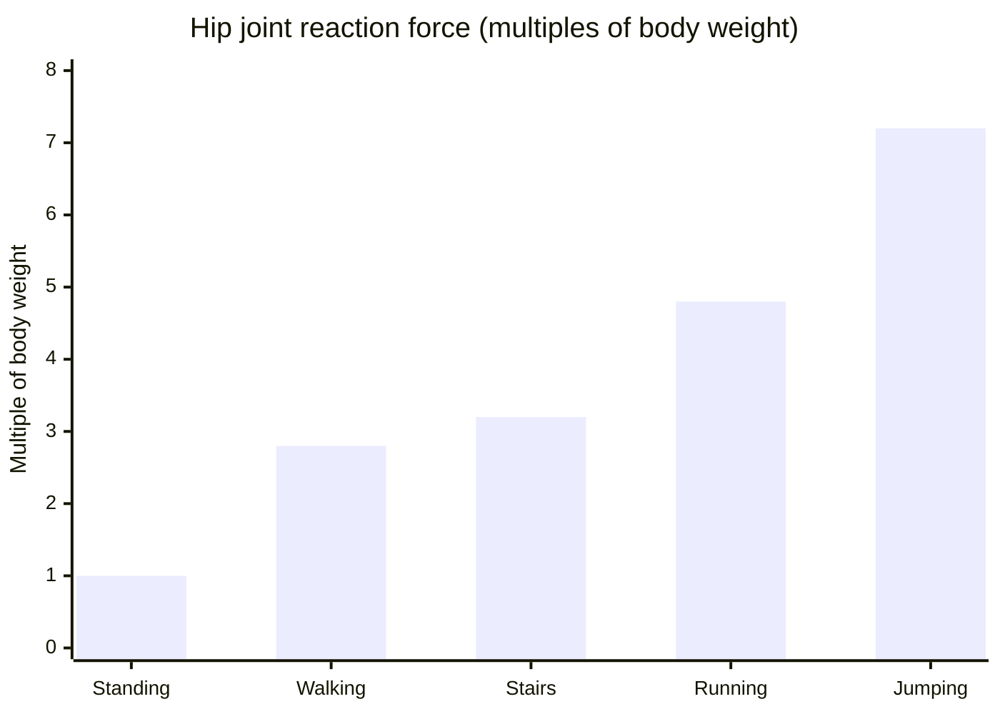

Stand on one leg right now. It feels trivial. The force pressing on the head of your femur at this exact moment is roughly **2.5 to 3 times your body weight**.

> Stand on one leg. If you weigh 70 kg, the force on your femoral head at this exact moment is roughly 200 kg — on a joint the size of a golf ball.

I first saw this number in a biomechanics lecture and didn't believe it. The math is elegant and completely counterintuitive.

## The hip as a lever system

The hip is a ball-and-socket joint, the femoral head rotating inside the acetabulum. To understand the forces, you need to think about it as a lever system, not just anatomy.

When you stand on one leg, your body creates a torque around the hip: the weight of the body (minus the supporting leg, roughly 5/6 of total body weight) acts at some horizontal distance from the joint center. Without a counteracting force, that torque would drop your pelvis toward the unsupported side.

The counteracting force comes from the **hip abductor muscles** (primarily the gluteus medius), which insert on the greater trochanter. The problem is that their moment arm is much shorter than the moment arm of body weight.

Typical values for an average adult:

- Body weight moment arm relative to hip center: ~10 cm
- Abductor muscle moment arm: ~5 cm

That 2:1 ratio means the abductor force must be roughly twice the weight it's balancing. And the joint reaction force on the femoral head is the **vector sum** of body weight and abductor force, both applied to the same joint in non-opposing directions.

*Data from Bergmann et al. (2001), OrthoLoad database -- in vivo measurements via instrumented prostheses.*

## Why this matters for prosthetics

A total hip replacement (over 450,000 per year in the US alone) has to survive these loads for millions of cycles. A normal-walking adult accumulates roughly 2 million gait cycles per year.

Materials are selected to handle this fatigue:

- **Femoral head**: alumina ceramic or cobalt-chromium alloy
- **Acetabular cup**: UHMWPE (ultra-high molecular weight polyethylene), engineered to minimize wear
- **Femoral stem**: titanium or cobalt-chromium alloy, with surface texture to encourage bone ingrowth

Despite all this, the average prosthesis lasts **15-20 years**. UHMWPE wear produces micrometric debris that triggers inflammatory bone resorption, leading to gradual implant loosening. That's the primary reason for revision surgery, and it's as much a materials engineering problem as a surgical one.

## The astronaut case

The most instructive extreme is microgravity.

On the International Space Station, bones don't receive normal mechanical loads. The gluteus medius doesn't need to work to keep the pelvis level. Without that stimulus, **muscle atrophy** and **bone remodeling** follow: bone loses mineral density and adapts to a zero-load environment.

Astronauts lose roughly 1-1.5% of bone mass per month in microgravity. Returning to Earth, their hips are mechanically more vulnerable than before the mission.

The body only builds what it needs. What it needs, it calculates load by load.

## Wolff's Law in practice

There's a practical implication that often gets overlooked: prolonged bed rest (for a hospitalized patient, for someone recovering from trauma) is not neutral for bone. It is actively harmful.

**Wolff's Law** (Julius Wolff, 1892) states that bone remodels in response to mechanical loads. More load, more bone. Less load, less bone. The trabecular architecture of the acetabulum and femoral head is oriented exactly along the force lines that emerge from this biomechanical analysis.

Standing on one leg isn't just walking. It's the mechanical signal that tells bone: stay strong here. This is a critical load path.

## References

- Bergmann G et al. (2001). Hip contact forces and gait patterns from routine activities. *Journal of Biomechanics*, 34(7), 859-871.
- Paul JP (1967). Forces transmitted by joints in the human body. *Proceedings of the Institution of Mechanical Engineers*, 181(3J), 8-15.
- Learmonth ID, Young C & Rorabeck C (2007). The operation of the century: total hip replacement. *The Lancet*, 370(9597), 1508-1519.
- Lang T et al. (2004). Cortical and trabecular bone mineral loss from the spine and hip in long-duration spaceflight. *Journal of Bone and Mineral Research*, 19(6), 1006-1012.
