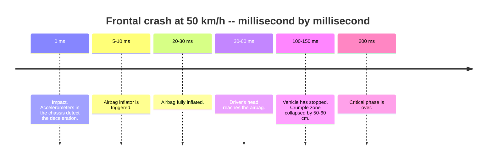

50 km/h doesn't sound fast. Then you do the physics.

A vehicle hitting a rigid barrier at 50 km/h and stopping undergoes an average deceleration of 30-40 g. Free fall is 0 g. A fairly aggressive rollercoaster tops out around 3-4 g. 30 g is a different category entirely, and the body has precise failure thresholds at that level.

This is not an article about driving safely. It's about what happens inside a human body in 200 milliseconds.

## How the energy dissipates

When a vehicle traveling at 50 km/h (roughly 14 m/s) hits a fixed barrier, the kinetic energy has to go somewhere. In a modern car with a crumple zone, that energy is absorbed through controlled deformation of the front structure, extending the deceleration to roughly **100-150 ms** while the front collapses by about 50-60 cm.

## The occupant keeps moving

The vehicle structure stops. The occupants don't, at least not immediately. They continue forward by inertia until something restrains them.

Without a seatbelt in a frontal collision:
- Torso moves forward
- Head hits the steering wheel or dashboard
- Knees hit the instrument panel
- Chest impacts the wheel

With a seatbelt, forces distribute across chest and pelvis. But the head isn't directly restrained. It continues forward, then snaps back violently. That's **whiplash**: hyperextension followed by hyperflexion of the cervical spine in a fraction of a second.

## Human tolerance thresholds

Biomechanics engineers measure these limits using **ATDs** (Anthropomorphic Test Devices): crash test dummies equipped with accelerometers, force sensors, and deformation gauges throughout the body.

For the head, the key parameter is **HIC** (Head Injury Criterion), which integrates head acceleration over time according to an empirical formula. The threshold for serious injury is HIC = 1000. An unprotected 50 km/h impact can generate HIC > 3000.

For the neck, **NIC** (Neck Injury Criterion) captures forces and moments on the cervical spine. Exceeding certain values causes ligament damage, facet joint injuries, and nerve root involvement.

For the thorax, sterno-vertebral compression above 30% correlates with internal organ injury.

## The airbag: explosive engineering

The front airbag is not a slowly inflating cushion. It's a pyrotechnic device.

From impact detection to fully inflated airbag: **20-30 ms**. In that time it has to travel from the steering wheel to the driver's face (roughly 25 cm) and reach maximum pressure before the head arrives.

If it were still inflating at the moment of contact, it would be more dangerous than protective. The timing is critical and varies with crash severity as detected by the sensors.

The bag deflates almost immediately after contact, releasing gas through side vents to dissipate energy without creating rigid resistance. The entire sequence (inflation, contact, deflation) happens in under 100 ms.

## Why 50 km/h specifically

The threshold appears in almost every urban speed regulation for one precise reason: it's where pedestrian fatality probability crosses from manageable to severe.

For a pedestrian (no structural protection, no seatbelt):

- At 30 km/h: fatality risk ~5%
- At 50 km/h: fatality risk ~30%
- At 70 km/h: fatality risk ~75%

> The relationship is non-linear because kinetic energy scales with the square of velocity. Doubling speed quadruples the energy to dissipate.

**Vision Zero**, born in Sweden in the late 1990s and adopted by many European cities, builds policy around this: no human error should cost a life. The engineering solution is reducing speeds to ranges where the human body has some tolerance margin.

## The AIS scale

Injuries in crashes are classified using **AIS** (Abbreviated Injury Scale): from AIS 1 (minor) to AIS 6 (unsurvivable). The composite **ISS** (Injury Severity Score) combines injuries across body regions.

ISS > 15 indicates a serious polytrauma. ISS > 25 carries significant mortality even with intensive treatment.

Regulated crash tests (Euro NCAP in Europe, NHTSA in the US) evaluate dummies post-impact by these criteria and assign star ratings based on estimated probability of AIS >= 3 injuries for driver and front passenger.

Biomechanics doesn't say how to drive. It says exactly how much the body can take, and builds protection systems around those limits.

## References

- Versace J (1971). A review of the severity index. *SAE Technical Paper* 710881.
- World Health Organization (2023). *Global Status Report on Road Safety 2023*. WHO Press.
- Otte D, Facius T & Johannsen H (2012). Injury severity and causation factors for cyclists and pedestrians in road accidents. *IRCOBI Conference Proceedings*, Dublin.
- Peden M et al. (2019). The relationship between impact speed and the probability of pedestrian fatality during a vehicle-pedestrian crash: A systematic review and meta-analysis. *Accident Analysis & Prevention*, 129, 241-249.
