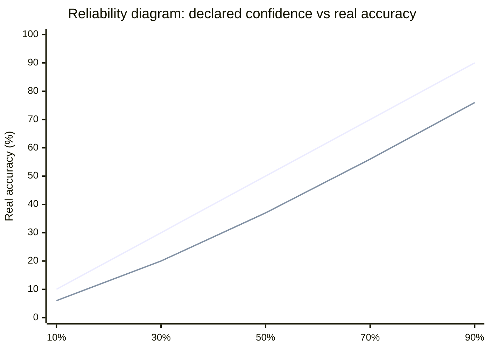

There's a specific failure mode that's worse than being wrong. It's being wrong with 99% confidence.

I ran into this during my thesis on automated sleep staging. The model looked fine by accuracy metrics, but something felt off: it assigned very high confidence scores even on predictions it got wrong. When I dug into it, I found a systematic property of modern deep learning called **overconfidence**. It's not specific to sleep staging. It's everywhere.

## The softmax illusion

When you train a classification model and run inference, you get output like this: Class A: 97%, Class B: 2%, Class C: 1%. That looks like a probability distribution. Often it isn't.

Those numbers come from **softmax**, a function that converts raw model outputs (logits) into values that sum to 1 and are all positive. Mathematically, it satisfies the definition of a probability distribution. Semantically, it frequently doesn't.

A model trained long enough on enough data learns to push probabilities toward 0 and 1, even on ambiguous inputs. The result: a model that says "99% Class A" on an example it's genuinely uncertain about, and gets it wrong.

This is not a bug in a specific architecture. It's a systematic property of modern deep learning.

## How to measure calibration

The standard tool for this is the **reliability diagram** (also called calibration plot):

1. Take all the model's predictions on a held-out validation set
2. Group them by confidence level (0-10%, 10-20%, ..., 90-100%)
3. For each group, calculate the actual fraction of correct predictions

A perfectly calibrated model sits on the diagonal: when it says 70% confident, it's right 70% of the time. In practice, modern models show a characteristic deviation at high confidence. When the model says 90%, the actual accuracy is often closer to 70-75%.

The first line is perfect calibration. The second is a typical overconfident model. The scalar metric for the gap is **ECE** (Expected Calibration Error): lower means better calibrated.

## Why this matters in practice

In many applications, overconfidence is a minor nuisance. In medicine, it becomes a real risk.

Imagine a chest X-ray classifier trained to distinguish healthy lungs from early-stage tumors. If the model says 98% healthy on an ambiguous scan, a radiologist might skip the follow-up. But if the model is poorly calibrated, that 98% means nothing.

The same logic applies to arrhythmia detection from ECG, cell anomaly detection in histopathology, or cardiovascular risk stratification. Accuracy alone isn't enough. The model needs to **know when it's uncertain**.

> In sleep staging, N1 is genuinely ambiguous even for trained technicians. Inter-rater agreement sits around 60-65%. A model that scores N1 at 95% confidence is claiming more certainty than human experts have on the same data.

## What you can do about it

The simplest effective fix is **temperature scaling**: a post-processing step that applies a learned scalar to soften the softmax output. It doesn't change which class the model predicts, only the confidence values. One parameter, trained on a separate validation set. Surprisingly effective.

More sophisticated approaches:

- **Monte Carlo Dropout**: keep dropout active during inference, run N forward passes. Variance across passes estimates uncertainty.
- **Deep ensembles**: train N independent networks on the same data. Disagreement between them is a proxy for uncertainty.
- **Conformal prediction**: a statistical framework that builds prediction sets with guaranteed coverage, independent of the underlying model architecture.

None of these fully solves the problem. But they make the uncertainty visible, which is the prerequisite for doing anything about it.

## The honest limit

I haven't found a solution I'm fully satisfied with for the sleep staging use case. Temperature scaling helps with in-distribution data, but calibration tends to degrade under dataset shift: when the test data comes from a different hospital, a different device, or a different patient population than training.

That's the harder problem, and I'm still working through it.

## References

- Guo C, Pleiss G, Sun Y & Weinberger KQ (2017). On calibration of modern neural networks. *Proceedings of the 34th ICML*, 70, 1321-1330.
- Lakshminarayanan B, Pritzel A & Blundell C (2017). Simple and scalable predictive uncertainty estimation using deep ensembles. *NeurIPS 2017*, 30.
- Ovadia Y et al. (2019). Can you trust your model's uncertainty? Evaluating predictive uncertainty under dataset shift. *NeurIPS 2019*, 32.
- Naeini MP, Cooper G & Hauskrecht M (2015). Obtaining well calibrated probabilities using Bayesian binning into quantiles. *AAAI 2015*, 29.
